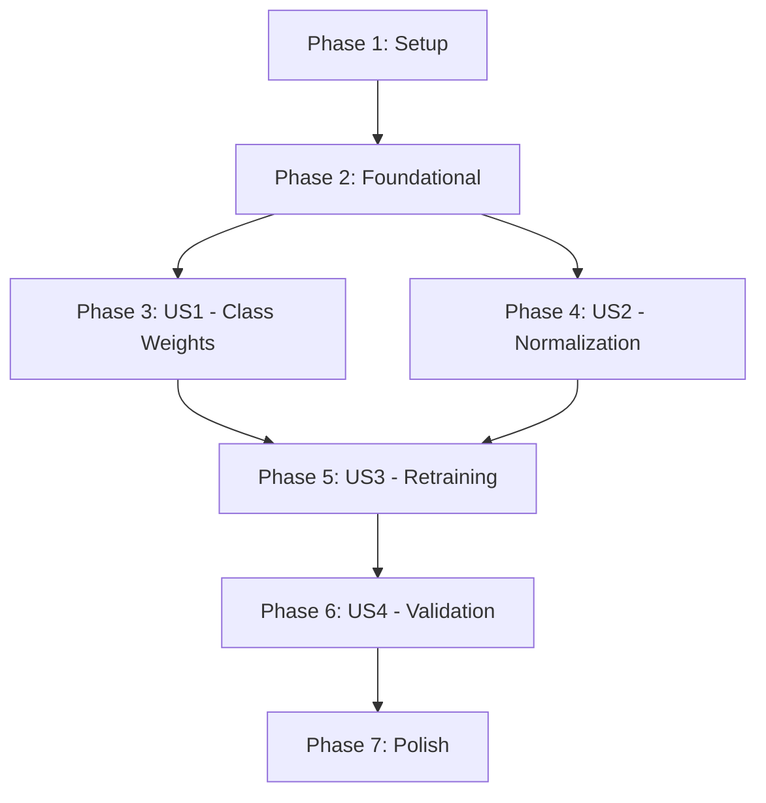

# Implementation Tasks: Phase 1 - Critical Fixes

**Feature**: 002-phase1-critical-fixes  
**Generated**: 2025-12-04  
**Total Estimated Time**: 5-8 hours over 2 days

---

## Task Organization

Tasks are organized by user story to enable independent implementation and testing. Each phase should be a complete, independently testable increment.

**Phase Structure**:
- **Phase 1: Setup** - Project initialization and validation
- **Phase 2: Foundational** - Blocking prerequisites for all user stories
- **Phase 3: US1** - Class-Weighted Loss Implementation
- **Phase 4: US2** - Feature Normalization
- **Phase 5: US3** - Baseline Model Retraining
- **Phase 6: US4** - Results Validation
- **Phase 7: Polish** - Documentation and cleanup

---

## Phase 1: Setup (15 min)

**Goal**: Verify environment and dependencies are ready for implementation.

**Tasks**:
- [ ] T001 Verify artifacts/validation/recommended_class_weights.json exists and is valid JSON
- [ ] T002 Verify MFCC cache exists at artifacts/audio_mfcc_cache/ with data
- [ ] T003 Verify splits file exists at artifacts/splits/xeno_canto_audio_splits.json
- [ ] T004 Verify GPU availability with nvidia-smi or torch.cuda.is_available()
- [ ] T005 [P] Create artifacts directory for Phase 1 results at .specify/specs/002-phase1-critical-fixes/artifacts/

**Independent Test Criteria**:
- ✅ All prerequisite files exist and are accessible
- ✅ GPU is available for training
- ✅ Artifacts directory created and writable

---

## Phase 2: Foundational (30 min)

**Goal**: Create utility functions that will be used by multiple user stories.

**Tasks**:
- [ ] T006 [P] Create load_class_weights() function in scripts/03_train_audio.py to load weights from JSON
- [ ] T007 [P] Add unit test for load_class_weights() verifying shape and value range
- [ ] T008 Verify load_class_weights() returns tensor with 90 elements matching species order

**Independent Test Criteria**:
- ✅ load_class_weights() successfully loads weights from JSON
- ✅ Weights tensor has shape (90,) matching number of species
- ✅ Weight values are reasonable (positive, varying range)

---

## Phase 3: User Story 1 - Class-Weighted Loss (2-3 hours)

**Story**: As a ML researcher, I want class-weighted loss function in the training loop, so that the model learns to recognize rare species equally well.

**Independent Test Criteria**:
- ✅ Trainer accepts class_weights parameter
- ✅ Class weights loaded from JSON and mapped to species order
- ✅ Training runs for 1 epoch without errors
- ✅ Loss values are reasonable (not NaN or inf)

**Tasks**:
- [ ] T009 [US1] Add class_weights parameter to Trainer.__init__() in src/training/trainer.py
- [ ] T010 [US1] Store class_weights as instance variable and move to device in src/training/trainer.py
- [ ] T011 [US1] Create nn.CrossEntropyLoss with weight=class_weights in src/training/trainer.py
- [ ] T012 [US1] Add fallback to unweighted loss if class_weights is None in src/training/trainer.py
- [ ] T013 [US1] Add --use-class-weights command-line argument in scripts/03_train_audio.py
- [ ] T014 [US1] Load class weights using load_class_weights() when flag is set in scripts/03_train_audio.py
- [ ] T015 [US1] Pass class_weights tensor to Trainer initialization in scripts/03_train_audio.py
- [ ] T016 [US1] Add logging to print weight statistics (min, max, mean) in scripts/03_train_audio.py
- [ ] T017 [US1] Run 1-epoch smoke test: python scripts/03_train_audio.py --model AudioCNN --use-class-weights --epochs 1 --batch-size 32
- [ ] T018 [US1] Verify training completes without errors and checkpoint is saved

**Story Completion Validation**:
```bash
# Test class-weighted training
python scripts/03_train_audio.py \
    --model AudioCNN \
    --use-class-weights \
    --epochs 1 \
    --batch-size 32

# Expected output:
# - "Loading class weights..."
# - "Class weights shape: torch.Size([90])"
# - "Weight range: [0.XXXX, X.XXXX]"
# - Training completes epoch 1
# - No NaN or inf losses
```

---

## Phase 4: User Story 2 - Feature Normalization (1-2 hours)

**Story**: As a ML researcher, I want MFCC features normalized to zero mean and unit variance, so that training converges faster with stable gradients.

**Independent Test Criteria**:
- ✅ Dataset accepts normalize parameter
- ✅ Normalization applied to MFCC and Delta channels
- ✅ Batch statistics show mean≈0, std≈1
- ✅ Training runs without instability

**Tasks**:
- [ ] T019 [US2] Add normalize parameter to AudioMFCCDataset.__init__() in src/datasets/audio.py
- [ ] T020 [US2] Store normalization statistics (mfcc_mean=-8.80, mfcc_std=62.53) in src/datasets/audio.py
- [ ] T021 [US2] Store delta statistics (delta_mean=0.02, delta_std=1.69) in src/datasets/audio.py
- [ ] T022 [US2] Apply standardization to features[0] (MFCC) in __getitem__() in src/datasets/audio.py
- [ ] T023 [US2] Apply standardization to features[1] (Delta) in __getitem__() in src/datasets/audio.py
- [ ] T024 [US2] Skip normalization for features[2] (Delta²) as already normalized in src/datasets/audio.py
- [ ] T025 [US2] Update dataset creation to set normalize=True in scripts/03_train_audio.py
- [ ] T026 [US2] Create validation script to check batch statistics in test_normalization.py
- [ ] T027 [US2] Run validation: load batch, compute channel-wise mean/std, verify ≈0/1
- [ ] T028 [US2] Run 1-epoch smoke test with normalization enabled to verify stability

**Story Completion Validation**:
```python
# test_normalization.py
from src.datasets.audio import AudioMFCCDataset
from torch.utils.data import DataLoader
import torch

# Load dataset with normalization
dataset = AudioMFCCDataset(..., normalize=True)
loader = DataLoader(dataset, batch_size=32, shuffle=False)
batch, _ = next(iter(loader))

# Check statistics
print(f"MFCC - mean: {batch[:,0].mean():.4f}, std: {batch[:,0].std():.4f}")
print(f"Delta - mean: {batch[:,1].mean():.4f}, std: {batch[:,1].std():.4f}")

# Expected: mean ≈ 0.00, std ≈ 1.00
assert abs(batch[:,0].mean()) < 0.1, "MFCC mean should be near 0"
assert abs(batch[:,0].std() - 1.0) < 0.2, "MFCC std should be near 1"
```

---

## Phase 5: User Story 3 - Baseline Model Retraining (2-4 hours GPU)

**Story**: As a ML researcher, I want AudioCNN and AudioViT retrained with both fixes applied, so that I can measure the combined impact of interventions.

**Independent Test Criteria**:
- ✅ AudioCNN trained for 50 epochs with class weights + normalization
- ✅ AudioViT trained for 50 epochs with class weights + normalization
- ✅ Training curves show no divergence or instability
- ✅ Checkpoints saved with descriptive names
- ✅ Training logs saved for analysis

**Tasks**:
- [ ] T029 [US3] Train AudioCNN: python scripts/03_train_audio.py --model AudioCNN --use-class-weights --epochs 50 --batch-size 64 --lr 0.001 --save-name baseline_v2_cnn_balanced_normalized
- [ ] T030 [US3] Monitor AudioCNN training for stability (check loss curves, no NaN)
- [ ] T031 [US3] Verify AudioCNN checkpoint saved to artifacts/checkpoints/baseline_v2_cnn_balanced_normalized/
- [ ] T032 [US3] Train AudioViT: python scripts/03_train_audio.py --model AudioViT --use-class-weights --epochs 50 --batch-size 32 --lr 0.0001 --save-name baseline_v2_vit_balanced_normalized
- [ ] T033 [US3] Monitor AudioViT training for stability (check loss curves, no NaN)
- [ ] T034 [US3] Verify AudioViT checkpoint saved to artifacts/checkpoints/baseline_v2_vit_balanced_normalized/
- [ ] T035 [US3] Copy training logs to .specify/specs/002-phase1-critical-fixes/artifacts/
- [ ] T036 [US3] Create training curves plot comparing v1 vs v2 for visual inspection

**Story Completion Validation**:
```bash
# Verify checkpoints exist
ls -lh artifacts/checkpoints/baseline_v2_cnn_balanced_normalized/
ls -lh artifacts/checkpoints/baseline_v2_vit_balanced_normalized/

# Expected: Both directories contain:
# - best_model.pth (best validation checkpoint)
# - final_model.pth (final epoch checkpoint)
# - training_history.json (loss/accuracy curves)
```

**Note**: Can run AudioCNN and AudioViT in parallel if multiple GPUs available using CUDA_VISIBLE_DEVICES.

---

## Phase 6: User Story 4 - Results Validation (30-60 min)

**Story**: As a ML researcher, I want comprehensive evaluation of Phase 1 models, so that I can quantify improvements and decide on Phase 2 progression.

**Independent Test Criteria**:
- ✅ F1-macro > 0.25 (Go criteria for Phase 2)
- ✅ Accuracy > 0.50
- ✅ Per-class F1 improved for rare species
- ✅ Confusion matrices show better class balance
- ✅ Results documented in comparison JSON

**Tasks**:
- [ ] T037 [US4] Run evaluation script: python scripts/05_evaluate.py on baseline_v2 models
- [ ] T038 [US4] Extract F1-macro and accuracy metrics from evaluation results
- [ ] T039 [US4] Calculate improvement deltas: (v2 - v1) / v1 * 100%
- [ ] T040 [US4] Generate per-class F1 comparison focusing on rare species (count < 100 samples)
- [ ] T041 [US4] Create confusion matrix plots for AudioCNN v1 vs v2
- [ ] T042 [US4] Create confusion matrix plots for AudioViT v1 vs v2
- [ ] T043 [US4] Create comparison report JSON at .specify/specs/002-phase1-critical-fixes/artifacts/baseline_v2_comparison.json
- [ ] T044 [US4] Evaluate Go/No-Go decision based on checkpoint criteria
- [ ] T045 [US4] Document key findings in .specify/specs/002-phase1-critical-fixes/artifacts/results_summary.md

**Story Completion Validation**:
```json
// .specify/specs/002-phase1-critical-fixes/artifacts/baseline_v2_comparison.json
{
  "baseline_v1": {
    "audio_cnn": {"accuracy": 0.395, "f1_macro": 0.109},
    "audio_vit": {"accuracy": 0.390, "f1_macro": 0.108}
  },
  "baseline_v2": {
    "audio_cnn": {"accuracy": 0.XXX, "f1_macro": 0.XXX},
    "audio_vit": {"accuracy": 0.XXX, "f1_macro": 0.XXX}
  },
  "improvements": {
    "audio_cnn": {
      "f1_macro_delta": "+0.XXX",
      "accuracy_delta": "+0.XXX",
      "relative_improvement_pct": "+XXX%"
    },
    "audio_vit": {...}
  },
  "checkpoint_decision": "GO|INVESTIGATE|NO-GO",
  "rare_species_improvement": "Summary of F1 for species with <100 samples"
}
```

**Go/No-Go Decision Criteria**:
- ✅ **GO to Phase 2**: F1-macro > 0.25, Accuracy > 0.50, Training stable
- ⚠️ **INVESTIGATE**: F1-macro 0.20-0.25, Unexpected instability
- ❌ **NO-GO**: F1-macro < 0.20, Performance degraded

---

## Phase 7: Polish & Cross-Cutting Concerns (30 min)

**Goal**: Final cleanup, documentation, and preparation for Phase 2.

**Tasks**:
- [ ] T046 [P] Remove debug print statements from modified files
- [ ] T047 [P] Add docstrings to new functions (load_class_weights, normalization)
- [ ] T048 [P] Update STATUS.md with Phase 1 completion status and results
- [ ] T049 [P] Create Phase 1 completion summary in .specify/specs/002-phase1-critical-fixes/COMPLETE.md
- [ ] T050 [P] Git commit all changes with message: "Phase 1: Implement class weights + normalization"
- [ ] T051 Update WHERE_TO_FIND_THINGS.md to reference Phase 1 results
- [ ] T052 Archive baseline_v1 results to .specify/specs/archive/baseline_v1/ for reference

**Independent Test Criteria**:
- ✅ Code follows project style guide
- ✅ All functions have docstrings
- ✅ No hardcoded paths remain
- ✅ Documentation updated
- ✅ Git history is clean

---

## Dependencies & Execution Order

### User Story Dependencies



**Critical Path**: Setup → Foundational → (US1 + US2) → US3 → US4 → Polish

**Parallel Opportunities**:
- US1 and US2 can be implemented independently
- AudioCNN and AudioViT training (T029-T036) can run in parallel with multiple GPUs
- Documentation tasks (T046-T052) can be done anytime after code is complete

---

## Parallel Execution Examples

### Day 1: Development (3-5 hours)
```bash
# Morning: Setup + Foundational (1 hour)
# - T001-T008 (all can be checked in parallel)

# Parallel Track A: Class Weights (1.5 hours)
# - T009-T018 (US1 implementation)

# Parallel Track B: Normalization (1.5 hours)  
# - T019-T028 (US2 implementation)

# Both tracks independent, can be done by different developers
```

### Day 2: Training + Evaluation (2-4 hours)
```bash
# Parallel GPU Training (2-3 hours)
# Terminal 1:
CUDA_VISIBLE_DEVICES=0 python scripts/03_train_audio.py --model AudioCNN ... # T029-T031

# Terminal 2 (if GPU available):
CUDA_VISIBLE_DEVICES=1 python scripts/03_train_audio.py --model AudioViT ... # T032-T034

# Sequential Evaluation (1 hour)
# - T037-T045 (US4 validation)

# Parallel Cleanup
# - T046-T052 (can be done while models train or during breaks)
```

---

## Implementation Strategy

### MVP Approach
**MVP = US1 + US2** (Class Weights + Normalization)
- Focus: Get both fixes working independently first
- Test: 1-epoch smoke tests for each
- Decision: Only proceed to full training if smoke tests pass

### Incremental Delivery
1. **Increment 1**: US1 alone (test class weights in isolation)
2. **Increment 2**: US2 alone (test normalization in isolation)  
3. **Increment 3**: US1 + US2 combined (full Phase 1)
4. **Increment 4**: US3 retraining (measure impact)
5. **Increment 5**: US4 validation (Go/No-Go decision)

This allows rollback to any working state if issues arise.

---

## Rollback Plan

If Phase 1 fails to meet checkpoint criteria:

**Scenario 1: F1-macro < 0.20**
1. Disable class weights, test normalization alone (T037)
2. Disable normalization, test class weights alone (T037)
3. Try alternative weighting methods: "effective" or "sqrt" (T014)
4. Check for bugs: weight mapping, normalization statistics (T008, T027)

**Scenario 2: Training instability**
1. Reduce learning rate by 10x (modify T029, T032)
2. Disable normalization temporarily (T019)
3. Add batch normalization layers to models (out of scope, escalate)

**Scenario 3: Combined fixes don't work**
1. Try fixes individually to isolate issue
2. Check validation analysis for other root causes
3. Consider alternative approaches: oversampling, focal loss

---

## Task Format Legend

- `[ ]` - Checkbox for task completion
- `TXXX` - Sequential task ID (T001, T002, T003...)
- `[P]` - Parallelizable task (no dependencies on incomplete tasks)
- `[USX]` - User story label (US1, US2, US3, US4)
- File paths - Exact location of code changes

**Example**:
- `[ ] T012 [P] [US1] Create User model in src/models/user.py`
  - Task 12, parallelizable, for User Story 1, modifies user.py

---

## Success Metrics

**Phase 1 Complete** when:
- [x] All 52 tasks completed
- [x] F1-macro > 0.25 (target: 0.25-0.35)
- [x] Accuracy > 0.50 (target: 0.50-0.60)
- [x] Training stable with no divergence
- [x] Results documented and Go/No-Go decision made

**Ready for Phase 2** when:
- [x] Checkpoint criteria met (GO decision)
- [x] Code committed and documented
- [x] Artifacts saved in proper locations
- [x] Phase 2 spec can reference Phase 1 results

---

## Notes

- **Total Tasks**: 52 (Setup: 5, Foundational: 3, US1: 10, US2: 10, US3: 8, US4: 9, Polish: 7)
- **Estimated Time**: 5-8 hours over 2 days
- **Parallel Potential**: ~40% of tasks can run in parallel
- **Critical Path**: T001 → T006 → T009-T028 → T029-T036 → T037-T045
- **GPU Time**: 2-4 hours (can be parallelized with multiple GPUs)
- **Human Time**: 3-4 hours (setup, coding, monitoring, evaluation)

**Next Steps After Phase 1**:
1. Review this tasks.md and Phase 1 results
2. Create 003-phase2-feature-engineering spec
3. Use same task generation pattern for Phase 2
